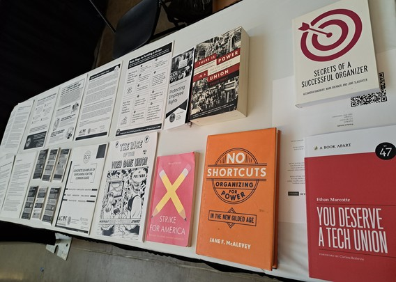

# Turn the Tables

## Who We Are

Turn the Tables is a new effort by workers in the tech industry to educate our fellow workers about their rights to organize and help empower them to do so.

We do this primarily through having a presence a tech conferences, which can include:

* tabling (ie in expo halls)
* providing resources such as books, zines, and flyers to conference attendees
* facilitating 1:1 conversations between conference attendees and labor lawyers, union organizers, and fellow tech workers who can answer their questions
* hosting happy hours, open spaces, workshops, and other places for workers to meet and get to know each other
* arranging conference talks, panels and posters as part of conference programming on topics related to organizing

This repository contains resources and links to resources for use by the Turn the Tables community or anyone else who wants to use them.

## How to Contribute

If you'd like to add a resource, feel free to create a pull request or open up an issue with a link and we can add it for you. Resources should be added as links in this readme. If you need a place to host a resource, you can add it to this repository's [resources folder](resources) and then link it.

If you'd like help creating a resource, would like to bring Turn the Tables to a specific tech conference or meetup, would like to partner with us, or otherwise want to get involved in the project, please email `shaunagm` @ `gmail` . `com`.

## Resources

### Zines, Pamphlets, and other printable materials

From the NLRB (more [here](https://www.nlrb.gov/news-publications/publications/brochures)):

* [Protecting Employee Rights](https://www.nlrb.gov/sites/default/files/attachments/pages/node-184/protecting-employee-rights-english_1.pdf)
* [NLRB Flyer](https://www.nlrb.gov/sites/default/files/attachments/pages/node-184/nlrb-flyer-627.pdf)
* [Employee Rights During a Union Organizing Campaign](https://www.nlrb.gov/sites/default/files/attachments/pages/node-184/employee-rights-while-organizing-627.pdf)
* [Basic Steps to Forming a Union](https://www.nlrb.gov/sites/default/files/attachments/pages/node-184/steps-to-forming-a-union-final-412.pdf)

Others:

* [Thinking about quitting your job? Here are 5 things you can do first.](https://workerorganizing.org/wp-content/uploads/2022/10/thinking-quitting-job-one-sheet.pdf) by the EWOC
* [Bargaining for the Common Good](https://www.bargainingforthecommongood.org/wp-content/uploads/2020/04/BCG-1-Pager-Why-BCG-v.2-22-20-1.pdf)
* [Key Elements of bargaining for the Common Good Campaigns](https://www.bargainingforthecommongood.org/wp-content/uploads/2020/04/BCG-Seven-Elements.pdf)
* [Just Cause - Using the Seven Tests](https://teamster.org/wp-content/uploads/2020/07/JustCause.pdf) by the Teamsters Union

Longer print-outs:

* [DMs Open: A Zine About Remote Organizing](https://collectiveaction.tech/2022/dms-open/) by Collective Actions In Tech (24 pages)
* [Concrete Examples of Bargaining for the Common Good](https://www.bargainingforthecommongood.org/wp-content/uploads/2021/01/Bargaining-Demands-Memo-Long-12.2020.pdf) (18 pages)
* [Bargaining for the Common Good Racial Justice Guide](https://www.nea.org/sites/default/files/2024-05/bargaining-for-the-common-good-racial-justice-guide_0.pdf) (46 pages)
* [The Rise of the Videogame Union](https://cdn.vox-cdn.com/uploads/chorus_asset/file/24262907/Polygon_The_Rise_of_the_Video_Game_Union.pdf) by Polygon (56 pages)
* [Secrets of a Successful Organizer: Training Guide](https://www.nea.org/sites/default/files/2020-11/Education%20Secrets%20Trainers%20Guide%20-%20June%2022.pdf) by the NEA (146 pages)

Posters:

* [You Don’t Have To Hate Your Job To Want A Union](https://justseeds.org/graphic/you-dont-have-to-hate-your-job-to-want-a-union/) by Sam Wallman

Stickers:

* [I like my hackers how I like my SQLi: IN A UNION;](resources/stickers/hacker_UNION_sticker/) 

### Books 

#### Tech-Specific

* [You Deserve a Tech Union](https://abookapart.com/products/you-deserve-a-tech-union) by Ethan Marcotte
* [Team Building: A Memoir about Family and the Fight for Workers' Rights](https://beltpublishing.com/products/team-building-inside-the-unionization-at-googles-pittsburgh-office) by Ben Gwin 

#### Not Tech-Specific

* [There Is Power In a Union by Philip Dray](https://www.penguinrandomhouse.com/books/42830/there-is-power-in-a-union-by-philip-dray/) - long but gripping complete history of labor in the United States
* [Red State Revolt by Eric Blanc](https://www.versobooks.com/products/912-red-state-revolt) - deep dive on the 2018 wave of wildcat teachers strike, fascinating and engaging
* [No Shortcuts by Jane McAlevey](https://janemcalevey.com/book/no-shortcuts-organizing-for-power-in-the-new-gilded-age/) - urgent and compelling call to change in how we organize, a little inside baseball (probably shouldn't be your first union book)
* [Strike for America by Micah Uetricht](https://www.penguinrandomhouse.com/books/234064/strike-for-america-by-micah-uetricht/) - the story of the transformation of the Chicago Teachers Union, also a little inside baseball, but again great
* [Secrets of a Successful Organizer by Alexandra Bradbury, Mark Brenner, and Jane Slaughter](https://www.labornotes.org/secrets) - a classic

### Podcasts

* [The Kickstarter Union - An Oral History](https://eclive.engelberg.center/) by Clarissa Redwine

### Conference Talks

* [What Tech Workers Can Learn from Harry Bridges](https://www.youtube.com/watch?v=SRjJ4_QBdeQ) by Kelsey Gilmore-Innis at the Forward 3 Web Summit
* [Organizing To Improve Your Workplace: Know Your Rights](https://www.youtube.com/watch?v=mWKygyFir54) by Shauna Gordon-McKeon at PyCon 2020
* [Know Your Rights as a Tech Worker](https://seagl.org/archive/2021/know-your-rights-as-a-tech-worker) by Shauna Gordon-McKeon at SeaGL 2021

### Organizations Supporting Tech Workers

* [Collective Actions in Tech](https://collectiveaction.tech/)
* [Coworker](https://home.coworker.org/)
* [Tech Workers Coalition](https://techworkerscoalition.org/)
* [Game Workers Unite!](https://www.gameworkersunite.org/)
* [Labor Notes](https://www.labornotes.org/)

### Unions Organizing Tech Workers

* [Communication Workers for America (CWA)](https://cwa-union.org/) ([C.O.D.E. Initiative](https://www.code-cwa.org/))
* [Office and Professional Employees International Union (OPEIU)](https://www.opeiu.org/) ([Tech Workers Local Union 1010](https://www.techworkersunion-1010.org/))
* ~[United Steel Workers (USW)](https://www.usw.org/) ([Federation of Tech Workers program](https://www.federationoftechworkers.org/))~ NOTE: USW no longer organizes tech workers

### Labor Organizing by Tech Users

* [Rideshare Drivers United](https://www.drivers-united.org/)
* [Gig Workers Rising](https://gigworkersrising.org/)
* [Turkopticon](https://blog.turkopticon.info/) (Amazon Mechanical Turk users)

### Misc Links

* [Bargaining for the Common Good](http://www.bargainingforthecommongood.org/about/)
* [The National Labor Relations Board’s website](https://www.nlrb.gov/about-nlrb/rights-we-protect/whats-law)
* [Definition of protected concerted activity](https://www.nlrb.gov/about-nlrb/rights-we-protect/our-enforcement-activity/protected-concerted-activity)
* [CWA guide to forming a union](https://cwa-union.org/join-union/how-organize)
* [Guide to Whistleblowing](https://www.taterenner.com/whistleblowers.php) by Tate Renner (see also  [whistleblowers.gov](https://www.whistleblowers.gov/))

### Employer-Specific Organizations

* [Kickstarter United](https://kickstarterunited.org/) (organized with OPEIU)
* [HCL union (Google contractor)](https://www.usw.org/news/media-center/releases/2019/workers-at-google-contractor-hcl-vote-to-join-usw) (organized with USW)
* [Glitch union](https://techcrunch.com/2021/03/02/following-unionization-glitch-signs-collective-bargaining-agreement/) (organized with CODE-CWA)
* [Blue State Digital union](https://www.campaignsandelections.com/campaign-insider/employees-at-democratic-firm-blue-state-unionized-by-code-cwa) (organized with CODE-CWA)
* [Alphabet Workers Union](https://alphabetworkersunion.org/) (organized with CODE-CWA)
* [Googlers for Climate Action](https://twitter.com/ClimateGooglers)
* [Google Walkout for Real Change](https://twitter.com/GoogleWalkout)
* [Googlers for Human Rights](https://twitter.com/EthicalGooglers)
* [Alphabet Workers Alliance](https://twitter.com/AlphabetWorkers)
* [Workers for Workers (Facebook)](https://twitter.com/workers4workers)
* [Facebook Employees for Climate Action](https://twitter.com/FBClimateAction)
* [Square Workers for Good](https://twitter.com/SquareWorkers)
* [Microsoft Workers for Good](https://twitter.com/MsWorkers4)
* [Tableau Employees Ethics Alliance](https://twitter.com/TabEmpEthicsAll)
* [Amazonians: We Won't Build It](https://twitter.com/WeWontBuildIt)
* [Githubbers](https://twitter.com/githubbers)

### Success Stories

* [Kickstarter](https://www.nytimes.com/2020/02/18/technology/kickstarter-union.html)
* [Glitch](https://techcrunch.com/2020/03/13/online-code-collaboration-tool-glitch-votes-to-unionize/)
* [HCL](https://economictimes.indiatimes.com/tech/ites/hcl-tech-employees-at-google-us-join-union/articleshow/71299050.cms)
* [Amazonians United](https://medium.com/@dch1united/amazonians-united-wins-pto-for-all-amazon-workers-f17e6ffbb192)
* [Googlers Against Forced Arbitration](https://www.vox.com/technology/2019/2/22/18236172/mandatory-forced-arbitration-google-employees)
* [Forced Arbitration Injustice Repeal Act](https://www.congress.gov/bill/116th-congress/house-bill/1423/text)
* [Organizing of Amazon’s warehouse in Shakopee, Minnesota](https://www.wired.com/story/meet-the-immigrants-who-took-on-amazon/)
* [Amazon workers push for union in Bessemer, Alabama](https://www.csmonitor.com/Business/2021/0212/Workers-organize-biggest-union-push-in-Amazon-s-history) 

### Worker Activism Around Layoffs

* [Layoff Guide](https://collectiveaction.tech/2022/a-layoff-guide-for-tweeps/) by Collective Actions In Tech
* [Voluntary Layoffs](https://careerminds.com/blog/voluntary-layoffs)
* [Alternatives to Layoffs](https://www.ueunion.org/stwd_layoffalternatives.html) by the UE Steward
* [Status Quo Protections for Unions](https://newsguild.org/what-is-status-quo-and-how-can-it-protect-you-from-layoffs/) by the News Guild
* [How newsroom unions intervene when members get laid off](https://digiday.com/media/how-newsroom-unions-intervene-when-members-get-laid-off/)
* [HUCTW's Worker Security Program for Layoffs](https://huctw.org/our-services/work-security-program) (NOTE: this is the union profiled in the excellent book [We Can't Eat Prestige: The Women Who Organized Harvard](https://www.goodreads.com/book/show/41550.We_Can_t_Eat_Prestige))
* [Code for America union agrees to new severance agreement after layoffs](https://statescoop.com/code-for-america-union-severance-layoffs/)
* [Workers in the game industry turn to unions for protection from rampant layoffs](https://prismreports.org/2024/03/19/video-game-workers-unionize-protection-layoffs/)